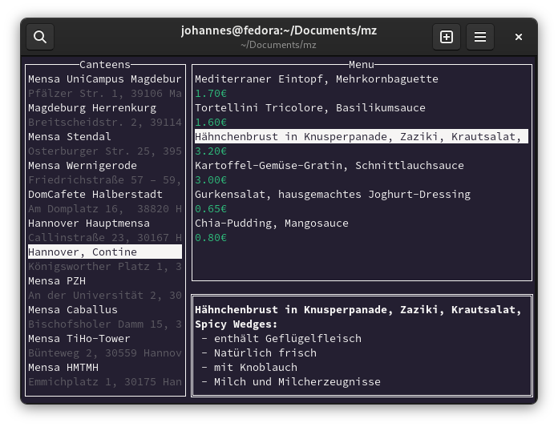

# mz

`mz` is a command-line canteen browser using [OpenMensa](https://openmensa.org).

The name mz is inspired by my German coworkers' [greetings for lunch](https://de.wikipedia.org/wiki/Mahlzeit#%E2%80%9EMahlzeit%E2%80%9C_als_Gru%C3%9F).  Contributions are very welcome!

## Install

Grab a precompiled binary from the [releases page](https://github.com/j0hax/mz/releases/latest) or install with `go install github.com/j0hax/mz@latest`
