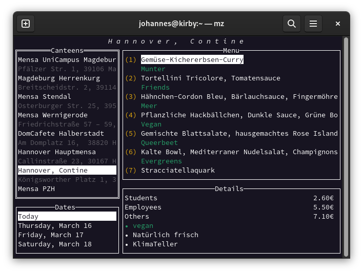

# mz

`mz` is a command-line canteen browser using [OpenMensa](https://openmensa.org). The name is inspired by my German coworkers' [greetings](https://de.wikipedia.org/wiki/Mahlzeit#%E2%80%9EMahlzeit%E2%80%9C_als_Gru%C3%9F) for lunch:

> Mahlzeit!

## Install

Grab a precompiled binary from the [releases page](https://github.com/j0hax/mz/releases/latest) or install with `go install github.com/j0hax/mz@latest`

## Usage

- Selecting a canteen in the top left panel loads its opening days and the meals served on those days
- Switch between different panels with <kbd>Tab</kbd>
- Exit the program with <kbd>Q</kbd> or <kbd>Ctrl</kbd> + <kbd>C</kbd>
- On subsequent launches, the program will restore the last viewed canteen. Alternatively, a canteen name can be passed as a parameter.
